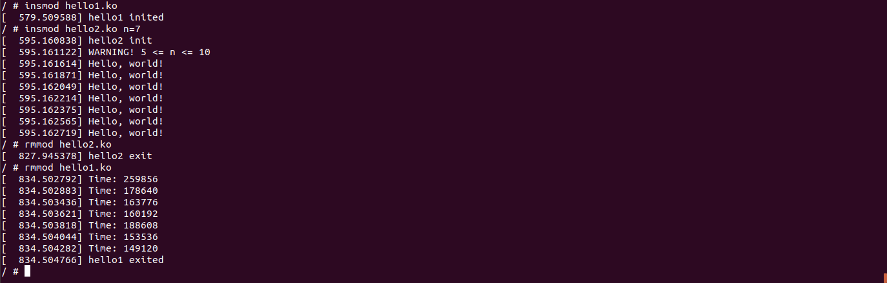

# AK-2 Lab6 
## Виконала: Головаш Анастасія 
## Група: ІВ-82

## Лістинг:

### hello.h
```
#include <linux/types.h>
int hello(uint n);
```

### hello1.c
```
// SPDX-License-Identifier: GPL-2-Clause
#include <linux/init.h>
#include <linux/module.h>
#include <linux/printk.h>
#include <linux/types.h>
#include <linux/slab.h>
#include <linux/ktime.h>
#include <hello1.h>

MODULE_LICENSE("Dual BSD/GPL");
MODULE_AUTHOR("Holovash Anastasia IV-82\n");
MODULE_DESCRIPTION("AK-2 Lab6 hello1\n");

struct timeit_list {
	struct list_head node;
	ktime_t before;
	ktime_t after;
};

static struct list_head head_node = LIST_HEAD_INIT(head_node);


int hello(uint n)
{
	struct timeit_list *list, *tmp;
	uint i;

	if (n < 0) {
		pr_err("ERROR! n < 0\n");
	} else if (n == 0) {
		pr_warn("WARNING! n = 0\n");
	} else if (n >= 5 && n <= 10) {
		pr_warn("WARNING! 5 <= n <= 10\n");
	} else if (n > 10) {
		pr_err("ERROR! n > 10\n");
		return -EINVAL;
	}

	for (i = 0; i < n; i++) {
		list = kmalloc(sizeof(struct timeit_list), GFP_KERNEL);
		if (ZERO_OR_NULL_PTR(list))
			goto clean_up;
		list->before = ktime_get();
		pr_info("Hello, world!\n");
		list->after = ktime_get();
		list_add_tail(&list->node, &head_node);
	}
	return 0;

clean_up:
	list_for_each_entry_safe(list, tmp, &head_node, node) {
		list_del(&list->node);
		kfree(list);
	}
	pr_err("ERROR! Memory is out\n");
	return -1;
}
EXPORT_SYMBOL(hello);


static int __init init_hello(void)
{
	pr_info("hello1 inited\n");
	return 0;
}


static void __exit exit_hello(void)
{
	struct timeit_list *list, *tmp;

	list_for_each_entry_safe(list, tmp, &head_node, node) {
		pr_info("Time: %lld", list->after - list->before);
		list_del(&list->node);
		kfree(list);
	}
	BUG_ON(!list_empty(&head_node));
	pr_info("hello1 exited\n");
}


module_init(init_hello);
module_exit(exit_hello);
```

### hello2.c
```
// SPDX-License-Identifier: GPL-2-Clause
#include <linux/init.h>
#include <linux/module.h>
#include <linux/printk.h>
#include <linux/types.h>
#include <linux/slab.h>
#include <linux/ktime.h>
#include <hello1.h>

MODULE_LICENSE("Dual BSD/GPL");
MODULE_DESCRIPTION("AK-2 Lab6 hello2\n");
MODULE_AUTHOR("Holovash Anastasia IV-82\n");

static uint n = 1;

module_param(n, uint, 0);
MODULE_PARM_DESC(n, "N of Hello, world!\n");

static int __init init_hello(void)
{
	pr_info("hello2 init\n");
	hello(n);
	return 0;
}

static void __exit exit_hello(void)
{
	pr_info("hello2 exit\n");
}

module_init(init_hello);
module_exit(exit_hello);
```

### Makefile
```
# add files from /inc to path
ccflags-y := -I$(PWD)/inc

ifneq ($(KERNELRELEASE),)
	# kbuild part of makefile
	obj-m := hello1.o hello2.o
else
	# normal makefile
	KDIR ?= /lib/modules/`uname -r`/build

default:
	$(MAKE) -C $(KDIR) M=$$PWD
clean:
	$(MAKE) -C $(KDIR) M=$$PWD clean
endif
```

## Перевірка відповідності Linux Kernel Coding Style:


## Результат роботи програми:




## Висновки:
Під час виконання лабораторної роботи було модифіковано програму з 5 лабораторної роботи, яка тепер показує час виводу "Hello, world!".
